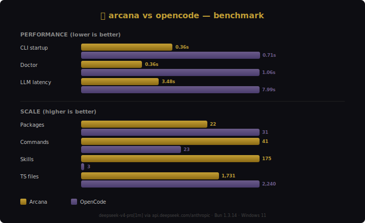

# ⛧ arcana

**Self-improving AI agent CLI** — skills, memory, gateway, coding, and cron in one terminal.

[](LICENSE)
[](https://github.com/Lento47/arcana-community)

## vs OpenCode

Arcana began as an OpenCode fork. It's now faster, leaner, and more capable.

<p align="center">
  
</p>

```sh
arcana doctor            # check system health
arcana doctor --web      # + checks for the web app
arcana run "query"       # one-shot agent session
arcana skills list       # browse available skills
arcana memory sessions   # view past sessions
arcana history list      # browse past sessions (alias)
arcana cron list         # list scheduled jobs
arcana gateway           # start chat bots (Telegram, Discord, Slack, WhatsApp)
arcana learn list        # view accumulated knowledge
arcana theme set dragon  # switch TUI theme
arcana feedback "..."    # send feedback
arcana web               # start the optional web app (packages/enterprise)
arcana web --build       # build the web app instead of starting dev mode
```

## Install

```sh
# From source (community edition)
git clone https://github.com/Lento47/arcana-community && cd arcana-community
bun install
bun packages/arcana/src/index.ts run "hello"
```

### Production binary (opt-in)

Prefer a prebuilt binary with auto-updates? Install `arcana-ai` from npm:

[](https://www.npmjs.com/package/arcana-ai)

```sh
npm install -g arcana-ai     # or: npx arcana-ai
arcana
```

The npm package ships the latest stable binary with all features. This community
source tree is the public mirror — it receives select patches and drives OSS
contributions. The binary is ahead of source (v0.2.46 vs v0.2.26).

## Quick start

```sh
# Set a provider key — works with any supported vendor
export OPENAI_API_KEY=sk-...        # or ANTHROPIC_API_KEY, GEMINI_API_KEY, etc.

# Verify everything is ready
arcana doctor

# Launch the terminal UI
arcana

# Or use the CLI
arcana run "explain this codebase"

# Browse and resume past sessions
arcana history list
arcana history resume --id <session-id>

# Search memory
arcana memory search --query "deployment config"
```

### Gateway (chat bots)

Configure in `~/.arcana/config.json`:
```json
{
  "provider": "openai",
  "model": "gpt-4o",
  "gateway": {
    "telegram": { "token": "111:xxx" },
    "discord": { "token": "xxx" },
    "slack": { "botToken": "xoxb-xxx", "signingSecret": "xxx" }
  }
}
```

```sh
arcana gateway
```

### Cron

```sh
# Every 4 hours: run code review
arcana cron add --name "review PRs" --schedule "0 */4 * * *" --prompt "review open PRs for bugs"

# Daily summary
arcana cron add --name "daily digest" --schedule "@daily" --prompt "summarize today's changes"

# List / remove / pause / resume / run-now
arcana cron list
arcana cron remove --id <job-id>
arcana cron pause --id <job-id>
arcana cron resume --id <job-id>
arcana cron run --id <job-id>
arcana cron start    # run daemon (blocking)
```

## Providers

Set a provider key as an environment variable and the matching provider lights up automatically — no per-vendor command needed:

```sh
export OPENAI_API_KEY=sk-...
export ANTHROPIC_API_KEY=sk-ant-...
export GEMINI_API_KEY=...
```

The full catalog of supported providers and their env keys is documented in `packages/arcana/src/provider/`. Use `arcana doctor` to confirm a key is detected.

## Packages

| Package | Description |
|---------|-------------|
| `@arcana/arcana` | CLI entry + agent runner |
| `@arcana/core` | Effect-based agent runtime, tools, session, database |
| `@arcana/engine` | Agent/session/tool/provider engine + TUI host (SolidJS + OpenTUI) |
| `@arcana/tui` | Terminal UI components, branding, theme |
| `@arcana/ui` | Web UI component library (SolidJS) |
| `@arcana/llm` | Multi-provider LLM routing (OpenAI, Anthropic, Gemini, Bedrock, etc.) |
| `@arcana/sdk` | JS SDK — typed API client + server spawner |
| `@arcana/server` | Hono + Effect HTTP API server |
| `@arcana/gateway` | Chat platform adapters (Telegram, Discord, Slack) |
| `@arcana/memory` | SQLite-backed conversation memory + FTS5 search |
| `@arcana/cron` | Scheduled agent jobs |
| `@arcana/skills` | Skill catalog (loaded from `skills/` + `~/.arcana/skills/`) |
| `@arcana/ml` | Signal engine — turn/tool signals, quality gate, ML runtime policy |
| `@arcana/plugin` | Plugin system (30+ lifecycle hooks) |
| `@arcana/enterprise` | SolidJS/Start web dashboard |
| `@arcana/function` | Cloudflare Worker with DurableObjects for share/sync |
| `@arcana/http-recorder` | VCR-style HTTP cassette recorder for Effect-based testing |

## Deep Dive

Undocumented features that are ready to use:

### `arcana memory` — FTS5-powered session memory

Search past session conversations, extracted facts, artifacts, and skill observations:
```sh
arcana memory search "deployment config"
arcana memory sessions --limit 10
arcana memory facts
arcana memory stats
```

### `arcana history` — browse and resume past sessions

List, inspect, and resume previous agent sessions:
```sh
arcana history list
arcana history show --id <session-id>
arcana history resume --id <session-id>
```

### `arcana learn` — self-improving knowledge pipeline

After sessions with 2+ turns, the agent extracts learnings into wiki files and a map of consciousness:
```sh
arcana learn list
arcana learn show --slug kebab-case-slug
arcana learn moc       # show map of consciousness
```

### `arcana doctor` — system health diagnostics

Check config, API keys, cache files, and runtime environment:
```sh
arcana doctor
```

### Gateway — Telegram, Discord, Slack, and WhatsApp

Four chat platform adapters with per-chat agent sessions. WhatsApp runs via Cloud API webhook (self-hosted HTTP server on port 3100):
```sh
arcana gateway
```

Configure in `~/.arcana/config.json` (see Gateway section below).

### `@arcana/http-recorder` — VCR-style HTTP cassette testing

Record and replay Effect HTTP client traffic with deterministic cassettes. Secret redaction, request matching, auto record/replay mode detection:
```ts
import { HttpRecorder } from "@arcana/http-recorder"
```

### `@arcana/function` — Cloudflare Worker with DurableObjects

Share/sync server using Cloudflare DurableObjects, GitHub App JWT token exchange, R2 storage, and a Feishu-to-Discord bridge. Deployed via SST.

### Cron daemon — scheduled autonomous agents

The cron scheduler runs as a persistent daemon, evaluating jobs every 60s. Jobs persist to a JSON store and integrate with memory:
```sh
arcana cron add --name "daily-review" --schedule "0 9 * * *" --prompt "review today's changes"
arcana cron list
arcana cron start     # run daemon (blocking)
```

### `@arcana/ml` — opt-in ML signal engine (NEW in 0.2.44)

Quality gate + expectation contract + silent revision. Off by default. Enable per session via env var:

```sh
ARCANA_ML_RUNTIME=1 arcana run "explain this codebase"
```

The engine detects generic filler (best practices, robust, scalable, …), forces specific output anchored to file/command names, and revises silently up to one round before showing the answer. Verifiable:

```sh
bun run ml:eval         # 12 eval fixtures, exits non-zero on regression
```

### `arcana web` — optional SolidJS web app

The web app lives in `packages/enterprise` (Vite + SolidJS Start + Nitro). It is optional — if `packages/enterprise/package.json` is missing, `arcana web` exits cleanly:

```sh
bun run dev:web         # vite dev on http://localhost:3002
bun run web:build       # production build
arcana web --host 127.0.0.1 --port 3000 --open
arcana web --build
arcana doctor --web     # checks enterprise pkg + source + build + vite + port
```

### Plugin lifecycle — 30+ hooks

The plugin system defines hooks for agent, tool, config, auth, chat, permissions, and workspace lifecycle events. Types and examples in `@arcana/plugin`:
```sh
arcana skills list          # available skills
arcana skills search "git"  # search by keyword
```

## Skills

Skills across categories: software-development, devops, security, data-science, blockchain, web-development, creative, productivity, and more.

```sh
arcana skills list
arcana skills search "python testing"
```

Skills live in `skills/` and `~/.arcana/skills/`. Each is a `SKILL.md` with YAML frontmatter — add your own.

## Configuration

`~/.arcana/config.json`:
```json
{
  "provider": "openai",
  "model": "gpt-4o",
  "apiKey": "sk-...",
  "dataDir": "~/.arcana/data",
  "memory": { "enabled": true, "maxSessions": 1000 },
  "cron": { "enabled": true, "intervalSeconds": 60 }
}
```

Env overrides: `ARCANA_PROVIDER`, `ARCANA_MODEL`, `ARCANA_API_KEY`, `OPENAI_API_KEY`.

## Dev

```sh
bun install
bun run typecheck       # turbo typecheck (16 packages)
bun run lint            # oxlint (warnings only; 0 errors required)
bun run test            # turbo test
bun run ml:eval         # @arcana/ml evaluation fixtures (12/12)
bun run smoke           # CLI/TUI/ML/web surface sanity check (~1s)
bun run verify          # lint + typecheck + test + ml:eval + build
bun run build           # turbo build
```

### Arcana TUI

```sh
bun run dev:tui          # from repo root
# or
bun run --cwd packages/engine --conditions=browser packages/engine/src/index.ts
```

### Arcana CLI (standalone, no TUI)

```sh
bun packages/arcana/src/index.ts run "hello"
```

## Themes

7 arcane themes. `⛧ themes` in the TUI or set in `~/.config/arcana/tui.json`:
```json
{ "theme": "dragon" }
```

Themes: arcana (default), bloodmoon, coven, crypt, dragon, lich, wraith.

### Background image

Set a custom full-screen background image (truecolor terminals — Kitty, iTerm2, WezTerm, Windows Terminal). In `~/.config/arcana/tui.json`:
```json
{
  "background": {
    "enabled": true,
    "image": "~/wallpapers/space.png",
    "opacity": 0.4,
    "fit": "cover"
  }
}
```
`opacity` (0–1) dims the image so text stays readable. PNG/JPEG. Shows on the home screen and empty areas; falls back to the theme color where unsupported.

## Thanks

Arcana builds on incredible open-source work:

- **[OpenCode](https://github.com/anomalyco/opencode)** — the TUI engine (SolidJS + OpenTUI), provider system, tools, and CLI architecture. Arcana began as a fork and would not exist without it.
- **[Hermes Agent](https://github.com/Lento47/hermes-agent)** — autonomous AI agent framework with sandboxing, memory, and multi-provider routing. Powers arcana's non-interactive agent mode.
- **[models.dev](https://models.dev)** — community model catalog powering arcana's provider auto-discovery (200+ models across 33 providers).
- **[Effect](https://effect.website)** — typed functional effect system for reliable concurrency, error handling, and dependency injection.
- **[Bun](https://bun.sh)** — JavaScript runtime, bundler, and compiler. The zero-dependency standalone binary is produced by `Bun.build({ compile })`.
- **[SolidJS](https://solidjs.com)** + **[OpenTUI](https://github.com/opentui/core)** — reactive UI framework + terminal rendering engine.
- **[AI SDK](https://sdk.vercel.ai)** — unified LLM provider interface (OpenAI, Anthropic, Google, Bedrock, and 30+ more).
- 174 skills from the open-source community across 28 categories.

All arcana modifications are MIT-licensed and upstreamable.

## License

Dual-licensed under MIT (non-commercial) and Commercial. See [LICENSE](LICENSE).
